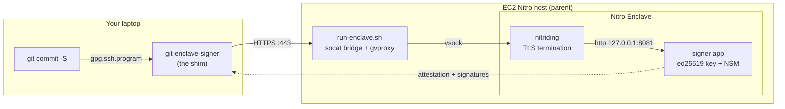

# secure-git-signer

Run a **git commit signer inside an AWS Nitro Enclave**. The ed25519 signing key
is generated *inside* the enclave and never leaves it. Your laptop talks to the
enclave over TLS — terminated *inside* the enclave by
[nitriding](https://github.com/brave/nitriding-daemon) — and the enclave proves,
via a Nitro Security Module (NSM) attestation document, that the public key you
are about to trust really belongs to known code running in a genuine, unmodified
enclave.

It is deliberately minimal — one EC2 host, one enclave, one signing endpoint —
so the moving parts stay visible: how an enclave is configured, how you get TLS
*into* one, and how attestation lets a remote client trust an enclave without
trusting the operator.

## The idea

`git` can sign commits with an SSH key (`gpg.format = ssh`). Normally that key
sits in `~/.ssh` on your laptop. Here, the private key lives in the enclave
instead, and `git` is pointed at a small **client shim** that forwards the
"please sign these bytes" request to the enclave and writes back the signature
`git` expects. The result is a normal, verifiable signed commit:

```
$ git commit -S -m "signed in an enclave"
$ git log --show-signature -1
Good "git" signature with ED25519 key SHA256:…
```

…except no human, and no process outside the enclave, ever held the private key.

## Architecture


### What this example leaves out

To stay bare-bones, the signing key is **ephemeral** — regenerated on every
enclave boot. A production system that needs a *persistent* signing identity
would wrap the key with AWS KMS and gate its release on the enclave's PCR0
measurement, so only an enclave running this exact code can decrypt it. That
(plus IAM credential plumbing and a real ACME-issued certificate) is a natural
next step but is intentionally out of scope here.

Because TLS is **self-signed** rather than ACME-issued, the enclave needs no
public DNS name, no port-443 raw-TCP load balancer, and no Let's Encrypt round
trip. `gvproxy` still runs on the host — nitriding uses it to bring up its
network stack — but nothing in the signing flow depends on outbound internet
from inside the enclave.

## Layout

| Path | What it is |
|------|-----------|
| `enclave/` | Go app that runs **inside** the enclave (key gen, SSHSIG, NSM attestation, HTTP API) |
| `client/`  | `git-enclave-signer` — the SSH-signer shim that runs on **your** machine |
| `build/`   | Dockerfile, nitriding entrypoint, `build-eif.sh` (→ PCR0), parent `run-enclave.sh` |
| `iac/`     | AWS CDK: a single Nitro-enabled EC2 host that runs the enclave |
| `docs/`    | Build, deploy, and usage walkthrough |

## Quick start

```bash
# 1. Build the enclave image and capture its PCR0 measurement (on an AL2023 host)
make eif

# 2. Deploy the EC2 host that runs it
make deploy

# 3. On your laptop, point git at the enclave
make signer                                        # build the client shim
git-enclave-signer attest https://<enclave-host>   # verify + print the trusted key
# …then configure git (gpg.format=ssh, gpg.ssh.program, user.signingkey)
git commit -S -m "hello from the enclave"
```

See [`docs/walkthrough.md`](docs/walkthrough.md) for the full step-by-step.

## License

MIT — see [LICENSE](LICENSE).
